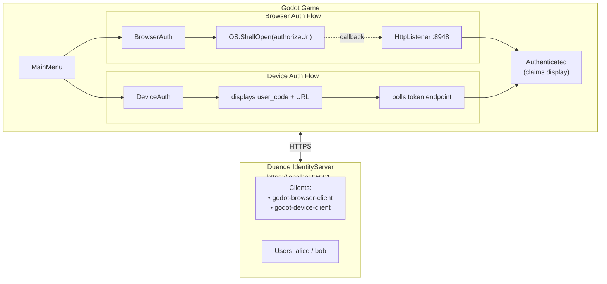

# Duende IdentityServer + Godot 4 Auth Sample

A self-contained sample demonstrating **OAuth 2.0 / OpenID Connect authentication in a Godot 4.x C# game**, using a locally-hosted [Duende IdentityServer](https://duendesoftware.com).

Two auth flows are implemented — pick whichever fits your deployment target:

| Flow | Scene | Best For |
|------|-------|----------|
| Authorization Code + PKCE | `BrowserAuth` | Desktop (Windows/Mac/Linux) |
| Device Authorization Grant | `DeviceAuth` | Consoles, TVs, any device |

---

## Architecture



---

## Prerequisites

| Requirement | Version |
|-------------|---------|
| [.NET SDK](https://dotnet.microsoft.com/download) | 8.0+ (10.0 recommended) |
| [Godot Engine](https://godotengine.org/download) | 4.4+ with .NET/C# support |
| A web browser | Any |

> **Important:** Trust the .NET developer certificate so the game can connect to `https://localhost:5001`:
> ```bash
> dotnet dev-certs https --trust
> ```

---

## Quick Start

### 1. Start IdentityServer

```bash
cd DuendeGodotSample
dotnet run --project src/IdentityServer
```

You should see output like:
```
Now listening on: https://localhost:5001
```

Verify it's working: open [https://localhost:5001/.well-known/openid-configuration](https://localhost:5001/.well-known/openid-configuration)

### 2. Run the Godot Game

Open the Godot editor and load the project from:
```
src/GodotGame/
```

Press **F5** (or **Play**) to run.

> **Alternatively**, if you have the Godot CLI:
> ```bash
> godot --path src/GodotGame
> ```

---

## Test Users

| Username | Password | Name | Email |
|----------|----------|------|-------|
| `alice` | `alice` | Alice Smith | alice@example.com |
| `bob` | `bob` | Bob Jones | bob@example.com |

---

## Auth Flows Explained

### Browser Auth (Authorization Code + PKCE)

1. Click **"Login with Browser (PKCE)"** in the game
2. The game generates a PKCE code verifier/challenge and starts `HttpListener` on `http://localhost:8948/`
3. Your system browser opens to the IdentityServer login page
4. Log in as `alice` or `bob`
5. IdentityServer redirects to `http://localhost:8948/callback?code=...`
6. The game captures the authorization code, serves a "close this tab" response, then exchanges the code for tokens
7. The game navigates to the Authenticated scene with your claims

### Device Code Auth (Device Authorization Grant)

1. Click **"Login with Device Code"** in the game
2. The game requests a device code from IdentityServer
3. A `user_code` and verification URL are displayed on screen
4. Click **"Open Verification URL in Browser"** (or manually navigate to the URL)
5. Enter the `user_code` and log in as `alice` or `bob`
6. The game polls the token endpoint in the background
7. On success, the game navigates to the Authenticated scene

---

## Project Structure

```
DuendeGodotSample/
├── DuendeGodotSample.slnx          # .NET solution (both projects)
├── .gitignore
├── README.md
└── src/
    ├── IdentityServer/              # Duende IdentityServer host
    │   ├── IdentityServer.csproj
    │   ├── Program.cs               # Minimal ASP.NET Core host
    │   ├── Config.cs                # Clients, scopes, test users
    │   ├── Properties/
    │   │   └── launchSettings.json  # https://localhost:5001
    │   └── Pages/                   # Default Duende UI (login, device, consent)
    └── GodotGame/                   # Godot 4.x C# game
        ├── project.godot
        ├── GodotGame.csproj         # IdentityModel NuGet dependency
        ├── Scenes/
        │   ├── MainMenu.tscn        # Flow selector
        │   ├── BrowserAuth.tscn     # Authorization Code + PKCE
        │   ├── DeviceAuth.tscn      # Device Authorization Grant
        │   └── Authenticated.tscn   # Claims display + logout
        ├── Scripts/
        │   ├── MainMenu.cs
        │   ├── BrowserAuthFlow.cs
        │   ├── DeviceAuthFlow.cs
        │   └── AuthenticatedScene.cs
        ├── Services/
        │   ├── OAuthService.cs      # Discovery, PKCE, token exchange, device flow
        │   └── TokenStorage.cs      # In-memory token store
        └── Theme/
            ├── DuendeTheme.tres     # Godot Theme resource (Duende brand colors)
            ├── Inter-Regular.ttf    # Inter font (OFL license)
            └── Inter-Bold.ttf
```

---

## Troubleshooting

**HTTPS certificate errors**
```bash
dotnet dev-certs https --trust
```
Then restart IdentityServer.

**Port 5001 already in use**
```bash
# Find and kill the process using port 5001
lsof -ti:5001 | xargs kill -9   # macOS/Linux
# Or change the port in src/IdentityServer/Properties/launchSettings.json
```

**Port 8948 already in use (browser callback)**  
Another process is using the callback port. Close it, or change the port in both:
- `src/IdentityServer/Config.cs` — `RedirectUris`
- `src/GodotGame/Services/OAuthService.cs` — `RedirectUri` constant

**Godot can't find .NET SDK**  
Ensure Godot 4 with .NET support is installed (not the standard Godot build). Download from [godotengine.org](https://godotengine.org/download) and choose the **.NET** variant.

**Device flow shows expired code**  
Device codes expire after a short time. Press **Back** and start the Device Auth flow again.

---

## License

- **Inter font**: [SIL Open Font License 1.1](https://scripts.sil.org/OFL)
- **Sample code**: MIT
- **Duende IdentityServer**: [Duende Software License](https://duendesoftware.com/license) (Free for 
  development/testing)
